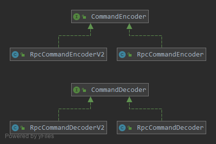
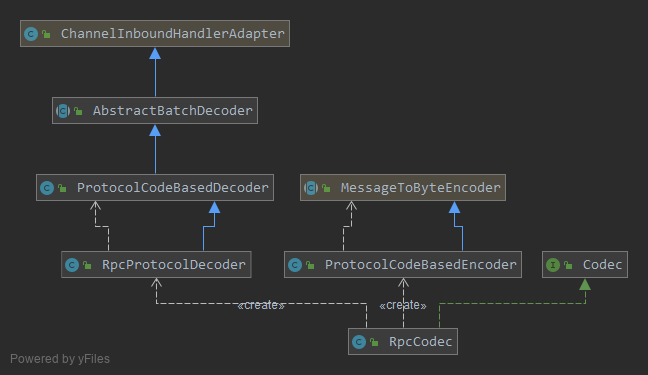

### 编解码器

* 编解码是由`CommandEncoder`与`CommandDecoder`接口定义的，实现了`Serializable`对象与`ByteBuf`之间的互转：
```java
public interface CommandEncoder {
    void encode(ChannelHandlerContext ctx, Serializable msg, ByteBuf out) throws Exception;
}

public interface CommandDecoder {
    void decode(ChannelHandlerContext ctx, ByteBuf in, List<Object> out) throws Exception;
}
```
它们的几个实现类实现了对不同版本的协议的编解码：  

   


* 在`Netty`的流水线中，上面的编解码器的功能是由`ProtocolCodeBasedEncoder`和`RpcProtocolDecoder`代理执行的，而`Codec`是创建这两个编解码器的工厂类：
```java
public interface Codec {

    ChannelHandler newEncoder();

    ChannelHandler newDecoder();
}

public class RpcCodec implements Codec {

    @Override
    public ChannelHandler newEncoder() {
        return new ProtocolCodeBasedEncoder(ProtocolCode.fromBytes(RpcProtocolV2.PROTOCOL_CODE));
    }

    @Override
    public ChannelHandler newDecoder() {
        return new RpcProtocolDecoder(RpcProtocolManager.DEFAULT_PROTOCOL_CODE_LENGTH);
    }
}
```

   


* 编码器
```java
@ChannelHandler.Sharable
public class ProtocolCodeBasedEncoder extends MessageToByteEncoder<Serializable> {

    protected ProtocolCode defaultProtocolCode;

    public ProtocolCodeBasedEncoder(ProtocolCode defaultProtocolCode) {
        super();
        this.defaultProtocolCode = defaultProtocolCode;
    }

    @Override
    protected void encode(ChannelHandlerContext ctx, Serializable msg, ByteBuf out) throws Exception {
        // 取出协议版本
        Attribute<ProtocolCode> att = ctx.channel().attr(Connection.PROTOCOL);
        ProtocolCode protocolCode;
        if (att == null || att.get() == null) {
            protocolCode = this.defaultProtocolCode;
        } else {
            protocolCode = att.get();
        }
        // 获取相应版本的协议对象
        Protocol protocol = ProtocolManager.getProtocol(protocolCode);
        // 从协议对象中取出CommandEncoder编码器进行编码
        protocol.getEncoder().encode(ctx, msg, out);
    }
}
```
编码器是直接继承`Netty`的编码器模板类实现的，从对协议版本的操作可以看出，bolt支持同时运行多个版本的协议

* 解码器    
解码器`RpcProtocolDecoder`继承自`ProtocolCodeBasedDecoder`，`ProtocolCodeBasedDecoder`继承`AbstractBatchDecoder`。     
`AbstractBatchDecoder`是bolt自己实现的一个解码器，相比于`Netty`的`ByteToMessageDecoder`，增加了批量解包的能力，即每次提交单个command改为可以一次提交整个List，减少了pipeline的执行次数，同时提升吞吐量，这个模式在低并发场景，并没有什么优势，而在高并发场景下对提升吞吐量有不小的性能提升。
```java
@Override
public void channelRead(ChannelHandlerContext ctx, Object msg) throws Exception {
    if (msg instanceof ByteBuf) {
        RecyclableArrayList out = RecyclableArrayList.newInstance();
        try {
            ByteBuf data = (ByteBuf) msg;
            first = cumulation == null;
            if (first) {
                cumulation = data;
            } else {
                cumulation = cumulator.cumulate(ctx.alloc(), cumulation, data);
            }
            callDecode(ctx, cumulation, out);
        } catch (DecoderException e) {
            throw e;
        } catch (Throwable t) {
            throw new DecoderException(t);
        } finally {
            if (cumulation != null && !cumulation.isReadable()) {
                numReads = 0;
                cumulation.release();
                cumulation = null;
            } else if (++numReads >= discardAfterReads) {
                numReads = 0;
                discardSomeReadBytes();
            }

            int size = out.size();
            if (size == 0) {
                decodeWasNull = true;
            } else if (size == 1) {
                // 如果只解包出一个对象，就只提交一个
                ctx.fireChannelRead(out.get(0));
            } else {
                // 如果解包出多个，将对象放到一个List批量提交
                // 靠后续的处理器来判断提交的是否是List
                ArrayList<Object> ret = new ArrayList<Object>(size);
                for (int i = 0; i < size; i++) {
                    ret.add(out.get(i));
                }
                ctx.fireChannelRead(ret);
            }
            out.recycle();
        }
    } else {
        ctx.fireChannelRead(msg);
    }
}
```