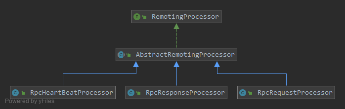

### 协议命令处理器

* `CommandHandler`接口用于处理消息以及注册不同类型命令的处理器
```java
public interface CommandHandler {

    void handleCommand(RemotingContext ctx, Object msg) throws Exception;

    void registerProcessor(CommandCode cmd, RemotingProcessor<?> processor);

    void registerDefaultExecutor(ExecutorService executor);

    ExecutorService getDefaultExecutor();
}
```
* `CommandHandler`接口有一个默认的实现类`RpcCommandHandler`：
```java
@Sharable
public class RpcCommandHandler implements CommandHandler {

    // 处理器管理器
    ProcessorManager processorManager;

    CommandFactory commandFactory;

    public RpcCommandHandler(CommandFactory commandFactory) {
        this.commandFactory = commandFactory;
        this.processorManager = new ProcessorManager();
        //process request
        this.processorManager.registerProcessor(RpcCommandCode.RPC_REQUEST, new RpcRequestProcessor(this.commandFactory));
        //process response
        this.processorManager.registerProcessor(RpcCommandCode.RPC_RESPONSE, new RpcResponseProcessor());

        this.processorManager.registerProcessor(CommonCommandCode.HEARTBEAT, new RpcHeartBeatProcessor());

        this.processorManager.registerDefaultProcessor(new AbstractRemotingProcessor<RemotingCommand>() {
                @Override
                public void doProcess(RemotingContext ctx, RemotingCommand msg) throws Exception {
                    logger.error("No processor available for command code {}, msgId {}", msg.getCmdCode(), msg.getId());
                }
            });
    }
}
```
在初始化的时候，传入一个`CommandFactory`，然后分别对rpc请求、rpc相应和心跳包注册了相应的处理器

* `RpcHandler`是作为`Netty`的处理器，被注册在流水线上，代理执行上面的`CommandHandler`：
```java
@ChannelHandler.Sharable
public class RpcHandler extends ChannelInboundHandlerAdapter {
    // 是否是服务器端
    private boolean serverSide;

    private ConcurrentHashMap<String, UserProcessor<?>> userProcessors;

    public RpcHandler() {
        serverSide = false;
    }

    public RpcHandler(ConcurrentHashMap<String, UserProcessor<?>> userProcessors) {
        serverSide = false;
        this.userProcessors = userProcessors;
    }

    public RpcHandler(boolean serverSide, ConcurrentHashMap<String, UserProcessor<?>> userProcessors) {
        this.serverSide = serverSide;
        this.userProcessors = userProcessors;
    }

    @Override
    public void channelRead(ChannelHandlerContext ctx, Object msg) throws Exception {
        // 获取协议版本
        ProtocolCode protocolCode = ctx.channel().attr(Connection.PROTOCOL).get();
        // 根据版本获取协议对象
        Protocol protocol = ProtocolManager.getProtocol(protocolCode);
        // 从协议对象中获取CommandHandler对象来处理收到的消息
        protocol.getCommandHandler().handleCommand(new RemotingContext(ctx, new InvokeContext(), serverSide, userProcessors), msg);
    }
}
```
`RpcHandler`中有一个`userProcessors`，这是一个map，key是请求对象的`Class`名，value是用户自己在`BoltClient`和`BoltServer`中注册的用户自定义的处理器，这个map被传入`RomtingContext`中，进而被`CommandHandler`对象引用。

* 消息处理
```java
// RpcCommandHandler
@Override
public void handleCommand(RemotingContext ctx, Object msg) throws Exception {
    this.handle(ctx, msg);
}

private void handle(final RemotingContext ctx, final Object msg) {
    try {
        // 如果是批量提交的消息
        if (msg instanceof List) {
            final Runnable handleTask = new Runnable() {
                @Override
                public void run() {
                    if (logger.isDebugEnabled()) {
                        logger.debug("Batch message! size={}", ((List<?>) msg).size());
                    }
                    for (final Object m : (List<?>) msg) {
                        RpcCommandHandler.this.process(ctx, m);
                    }
                }
            };
            // 在业务线程池里处理批量消息 还是在IO线程处理消息
            if (RpcConfigManager.dispatch_msg_list_in_default_executor()) {
                processorManager.getDefaultExecutor().execute(handleTask);
            } else {
                handleTask.run();
            }
        } else {
            // 单个提交的消息
            process(ctx, msg);
        }
    } catch (final Throwable t) {
        processException(ctx, msg, t);
    }
}
```
`RpcHandler`是接着`Netty`的解码器被调用的，bolt的解码器可以批量提交，所以这里先对消息类型做了一个判断，如果是`List`则是批量提交，这时候要根据配置来决定是在业务线程池里去处理还是在IO线程去处理。

```java
@SuppressWarnings({ "rawtypes", "unchecked" })
private void process(RemotingContext ctx, Object msg) {
    try {
        // 根据不同的消息类型(rpc请求 rpc相应 心跳包)获取不同的消息处理器来处理消息
        final RpcCommand cmd = (RpcCommand) msg;
        final RemotingProcessor processor = processorManager.getProcessor(cmd.getCmdCode());
        processor.process(ctx, cmd, processorManager.getDefaultExecutor());
    } catch (final Throwable t) {
        processException(ctx, msg, t);
    }
}
```

* `RemotingProcessor`接口是具体来处理各种消息的，它有三个具体实现类：`RpcRequestProcessor`，`RpcResponseProcessor`，`RpcHeartBeatProcessor`；处理消息最终都会调用到它们的`doProcess`方法上

    

* `RpcRequestProcessor`：
```java
@SuppressWarnings({ "rawtypes", "unchecked" })
@Override
public void doProcess(final RemotingContext ctx, RpcRequestCommand cmd) throws Exception {

    ... ...

    // 将请求根据请求对象的类型，分发到用户自定义的处理器上去
    dispatchToUserProcessor(ctx, cmd);
}
```
```java
private void dispatchToUserProcessor(RemotingContext ctx, RpcRequestCommand cmd) {
    final int id = cmd.getId();
    final byte type = cmd.getType();
    // 根据请求对象类名获取用户自定义处理器
    UserProcessor processor = ctx.getUserProcessor(cmd.getRequestClass());
    // 用户处理器分为同步与异步
    if (processor instanceof AsyncUserProcessor) {
        try {
            processor.handleRequest(processor.preHandleRequest(ctx, cmd.getRequestObject()), new RpcAsyncContext(ctx, cmd, this), cmd.getRequestObject());
        } catch (RejectedExecutionException e) {
            logger.warn("RejectedExecutionException occurred when do ASYNC process in RpcRequestProcessor");
            sendResponseIfNecessary(ctx, type, this.getCommandFactory().createExceptionResponse(id, ResponseStatus.SERVER_THREADPOOL_BUSY));
        } catch (Throwable t) {
            String errMsg = "AYSNC process rpc request failed in RpcRequestProcessor, id=" + id;
            logger.error(errMsg, t);
            sendResponseIfNecessary(ctx, type, this.getCommandFactory().createExceptionResponse(id, t, errMsg));
        }
    } else {
        try {
            // 同步处理，并将返回结果写回响应
            Object responseObject = processor.handleRequest(processor.preHandleRequest(ctx, cmd.getRequestObject()), cmd.getRequestObject());
            sendResponseIfNecessary(ctx, type, this.getCommandFactory().createResponse(responseObject, cmd));
        } catch (RejectedExecutionException e) {
            logger.warn("RejectedExecutionException occurred when do SYNC process in RpcRequestProcessor");
            sendResponseIfNecessary(ctx, type, this.getCommandFactory().createExceptionResponse(id, ResponseStatus.SERVER_THREADPOOL_BUSY));
        } catch (Throwable t) {
            String errMsg = "SYNC process rpc request failed in RpcRequestProcessor, id=" + id;
            logger.error(errMsg, t);
            sendResponseIfNecessary(ctx, type, this.getCommandFactory().createExceptionResponse(id, t, errMsg));
        }
    }
}
```
在`sendResponseIfNecessary`方法中会判断请求类型，除`oneway`调用外，其他几种类型，都要将处理结果或异常信息写入响应。

* `RpcResponseProcessor`
```java
public class RpcResponseProcessor extends AbstractRemotingProcessor<RemotingCommand> {

    private static final Logger logger = BoltLoggerFactory.getLogger("RpcRemoting");

    public RpcResponseProcessor() {

    }

    public RpcResponseProcessor(ExecutorService executor) {
        super(executor);
    }

    @Override
    public void doProcess(RemotingContext ctx, RemotingCommand cmd) {
        Connection conn = ctx.getChannelContext().channel().attr(Connection.CONNECTION).get();
        InvokeFuture future = conn.removeInvokeFuture(cmd.getId());
        ClassLoader oldClassLoader = null;
        try {
            if (future != null) {
                if (future.getAppClassLoader() != null) {
                    oldClassLoader = Thread.currentThread().getContextClassLoader();
                    Thread.currentThread().setContextClassLoader(future.getAppClassLoader());
                }
                // 将消息放入future对象中
                // 相当于countDown
                future.putResponse(cmd);
                future.cancelTimeout();
                try {
                    future.executeInvokeCallback();
                } catch (Exception e) {
                    logger.error("Exception caught when executing invoke callback, id={}", cmd.getId(), e);
                }
            } else {
                logger.warn("Cannot find InvokeFuture, maybe already timeout, id={}, from={} ", cmd.getId(), RemotingUtil.parseRemoteAddress(ctx.getChannelContext().channel()));
            }
        } finally {
            if (null != oldClassLoader) {
                Thread.currentThread().setContextClassLoader(oldClassLoader);
            }
        }
    }
}
```

* `RpcHeartBeatProcessor`，心跳请求与响应共用一个处理器，通过对消息类型做判断来区分。
```java
public class RpcHeartBeatProcessor extends AbstractRemotingProcessor {
    private static final Logger logger = BoltLoggerFactory.getLogger("RpcRemoting");

    @Override
    public void doProcess(final RemotingContext ctx, RemotingCommand msg) {
        // 服务器处理心跳请求
        if (msg instanceof HeartbeatCommand) {
            final int id = msg.getId();
            if (logger.isDebugEnabled()) {
                logger.debug("Heartbeat received! Id=" + id + ", from " + RemotingUtil.parseRemoteAddress(ctx.getChannelContext().channel()));
            }
            HeartbeatAckCommand ack = new HeartbeatAckCommand();
            ack.setId(id);
            // 发送心跳响应
            ctx.writeAndFlush(ack).addListener(new ChannelFutureListener() {
                @Override
                public void operationComplete(ChannelFuture future) throws Exception {
                    if (future.isSuccess()) {
                        if (logger.isDebugEnabled()) {
                            logger.debug("Send heartbeat ack done! Id={}, to remoteAddr={}", id, RemotingUtil.parseRemoteAddress(ctx.getChannelContext().channel()));
                        }
                    } else {
                        logger.error("Send heartbeat ack failed! Id={}, to remoteAddr={}", id, RemotingUtil.parseRemoteAddress(ctx.getChannelContext().channel()));
                    }
                }
            });
        } else if (msg instanceof HeartbeatAckCommand) {
            // 客户端处理心跳响应
            Connection conn = ctx.getChannelContext().channel().attr(Connection.CONNECTION).get();
            InvokeFuture future = conn.removeInvokeFuture(msg.getId());
            // 如果能从Connection中取到InvokeFuture对象，说明心跳还没超时
            if (future != null) {
                // 将心跳响应放入future对象中 并 取消超时任务
                future.putResponse(msg);
                future.cancelTimeout();
                try {
                    // 触发onResponse回调
                    future.executeInvokeCallback();
                } catch (Exception e) {
                    logger.error("Exception caught when executing heartbeat invoke callback. From {}", RemotingUtil.parseRemoteAddress(ctx.getChannelContext().channel()), e);
                }
            } else {
                // 否则在心跳响应到达之前，已经超时了
                logger.warn("Cannot find heartbeat InvokeFuture, maybe already timeout. Id={}, From {}", msg.getId(), RemotingUtil.parseRemoteAddress(ctx.getChannelContext().channel()));
            }
        } else {
            throw new RuntimeException("Cannot process command: " + msg.getClass().getName());
        }
    }
}
```