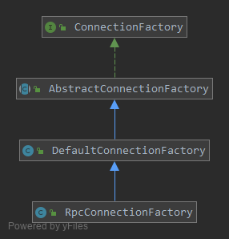

### ConnectionFactory

  


`ConnectionFactory`接口定义了最基本的创建连接的方法：
```java
public interface ConnectionFactory {

    void init(ConnectionEventHandler connectionEventHandler);

    Connection createConnection(Url url) throws Exception;

    Connection createConnection(String targetIP, int targetPort, int connectTimeout) throws Exception;

    Connection createConnection(String targetIP, int targetPort, byte version, int connectTimeout) throws Exception;
}
```
`AbstractConnectionFactory`是主要的实现类：    
```java
public abstract class AbstractConnectionFactory implements ConnectionFactory {

    private static final Logger logger = BoltLoggerFactory.getLogger(AbstractConnectionFactory.class);

    // 所有客户端Channel共享的一个EventLoopGroup
    private static final EventLoopGroup workerGroup = NettyEventLoopUtil
                    .newEventLoopGroup(Runtime.getRuntime().availableProcessors() + 1, new NamedThreadFactory("bolt-netty-client-worker", true));

    private final ConfigurableInstance  confInstance;
    // 编解码器
    private final Codec                 codec;
    // 心跳处理器
    private final ChannelHandler        heartbeatHandler;
    // 消息处理器
    private final ChannelHandler        handler;
    
    protected Bootstrap                 bootstrap;
}
```
---

初始化过程：
```java
@Override
public void init(final ConnectionEventHandler connectionEventHandler) {
    bootstrap = new Bootstrap();
    bootstrap.group(workerGroup).channel(NettyEventLoopUtil.getClientSocketChannelClass())
        .option(ChannelOption.TCP_NODELAY, ConfigManager.tcp_nodelay())
        .option(ChannelOption.SO_REUSEADDR, ConfigManager.tcp_so_reuseaddr())
        .option(ChannelOption.SO_KEEPALIVE, ConfigManager.tcp_so_keepalive());

    // init netty write buffer water mark
    initWriteBufferWaterMark();

    // init byte buf allocator
    if (ConfigManager.netty_buffer_pooled()) {
        this.bootstrap.option(ChannelOption.ALLOCATOR, PooledByteBufAllocator.DEFAULT);
    } else {
        this.bootstrap.option(ChannelOption.ALLOCATOR, UnpooledByteBufAllocator.DEFAULT);
    }

    bootstrap.handler(new ChannelInitializer<SocketChannel>() {

        @Override
        protected void initChannel(SocketChannel channel) {
            ChannelPipeline pipeline = channel.pipeline();
            pipeline.addLast("decoder", codec.newDecoder());
            pipeline.addLast("encoder", codec.newEncoder());

            boolean idleSwitch = ConfigManager.tcp_idle_switch();
            if (idleSwitch) {
                pipeline.addLast("idleStateHandler",
                    new IdleStateHandler(ConfigManager.tcp_idle(), ConfigManager.tcp_idle(), 0,
                        TimeUnit.MILLISECONDS));
                pipeline.addLast("heartbeatHandler", heartbeatHandler);
            }

            pipeline.addLast("connectionEventHandler", connectionEventHandler);
            pipeline.addLast("handler", handler);
        }
    });
}
```

工厂初始化的过程就是`Netty`里`Bootstrap`创建并初始化的过程，pipeline上配置的处理器依次是：
* 解码器
* 编码器
* 如果配置了心跳开关
    * `IdleStateHandler`连接空闲处理器
    * `HeartbeatHandler`心跳处理器
* `ConnectionEventHandler`，连接事件处理器
* 自定义的消息处理器

---

连接创建：
```java
@Override
public Connection createConnection(Url url) throws Exception {
    // 连接远程服务器，创建一个Netty的Channel
    Channel channel = doCreateConnection(url.getIp(), url.getPort(), url.getConnectTimeout());
    // 用Channel构建Connection对象
    Connection conn = new Connection(channel, ProtocolCode.fromBytes(url.getProtocol()),
        url.getVersion(), url);
    // 触发连接创建事件
    channel.pipeline().fireUserEventTriggered(ConnectionEventType.CONNECT);
    return conn;
}

// 连接远程服务器创建Channel对象
protected Channel doCreateConnection(String targetIP, int targetPort, int connectTimeout) throws Exception {
    // prevent unreasonable value, at least 1000
    connectTimeout = Math.max(connectTimeout, 1000);
    String address = targetIP + ":" + targetPort;
    if (logger.isDebugEnabled()) {
        logger.debug("connectTimeout of address [{}] is [{}].", address, connectTimeout);
    }
    bootstrap.option(ChannelOption.CONNECT_TIMEOUT_MILLIS, connectTimeout);
    ChannelFuture future = bootstrap.connect(new InetSocketAddress(targetIP, targetPort));

    future.awaitUninterruptibly();
    if (!future.isDone()) {
        String errMsg = "Create connection to " + address + " timeout!";
        logger.warn(errMsg);
        throw new Exception(errMsg);
    }
    if (future.isCancelled()) {
        String errMsg = "Create connection to " + address + " cancelled by user!";
        logger.warn(errMsg);
        throw new Exception(errMsg);
    }
    if (!future.isSuccess()) {
        String errMsg = "Create connection to " + address + " error!";
        logger.warn(errMsg);
        throw new Exception(errMsg, future.cause());
    }
    return future.channel();
}
```