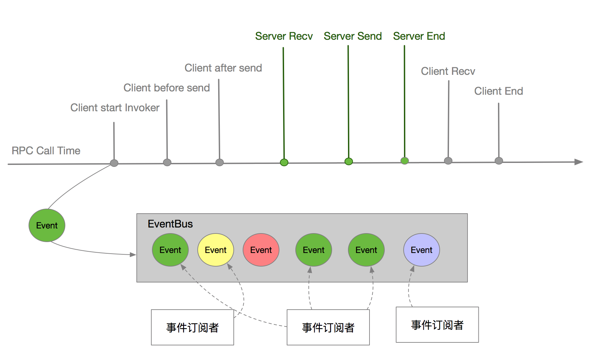

### 事件总线

* 向事件总线中丢一个事件，订阅者可以对感兴趣的事件进行处理
  

* `Event`接口：
```java
public interface Event {

}
```

* 订阅者`Subscriber`：
```java
public abstract class Subscriber {
    
    // 接到事件是否同步执行
    protected boolean sync = true;

    protected Subscriber() {
    }

    protected Subscriber(boolean sync) {
        this.sync = sync;
    }

    public boolean isSync() {
        return sync;
    }

    // 事件处理，请处理异常
    public abstract void onEvent(Event event);

}
```

* 事件总线`EventBus`中用一个`Map`来存储事件与订阅者之间的关系，key为事件的`Class`对象，value为订阅此事件的订阅者集合：
```java
private final static ConcurrentMap<Class<? extends Event>, CopyOnWriteArraySet<Subscriber>> SUBSCRIBER_MAP = new ConcurrentHashMap<>();
```

注册一个订阅者：
```java
public static void register(Class<? extends Event> eventClass, Subscriber subscriber) {
    CopyOnWriteArraySet<Subscriber> set = SUBSCRIBER_MAP.get(eventClass);
    if (set == null) {
        set = new CopyOnWriteArraySet<Subscriber>();
        CopyOnWriteArraySet<Subscriber> old = SUBSCRIBER_MAP.putIfAbsent(eventClass, set);
        // 并发控制
        if (old != null) {
            set = old;
        }
    }
    set.add(subscriber);
}
```

向总线中丢一个事件：
```java
public static void post(final Event event) {
    if (!isEnable()) {
        return;
    }
    // 获取此事件订阅者
    CopyOnWriteArraySet<Subscriber> subscribers = SUBSCRIBER_MAP.get(event.getClass());
    // 如果存在订阅者
    if (CommonUtils.isNotEmpty(subscribers)) {
        for (final Subscriber subscriber : subscribers) {
            if (subscriber.isSync()) {
                // 如果订阅者是同步处理，就立即在当前线程中处理事件
                handleEvent(subscriber, event);
            } else { // 异步丢到线程池执行
                final RpcInternalContext context = RpcInternalContext.peekContext();
                final ThreadPoolExecutor asyncThreadPool = AsyncRuntime.getAsyncThreadPool();
                try {
                    asyncThreadPool.execute(() -> {
                        try {
                            // 设置上下文
                            RpcInternalContext.setContext(context);
                            handleEvent(subscriber, event);
                        } finally {
                            RpcInternalContext.removeContext();
                        }
                    });
                } catch (RejectedExecutionException e) {
                    LOGGER.warn("This queue is full when post event to async execute, queue size is " + asyncThreadPool.getQueue().size() + ", please optimize this async thread pool of eventbus.");
                }
            }
        }
    }
}

private static void handleEvent(final Subscriber subscriber, final Event event) {
    try {
        subscriber.onEvent(event);
    } catch (Throwable e) {
        if (LOGGER.isWarnEnabled()) {
            LOGGER.warn("Handle " + event.getClass() + " error", e);
        }
    }
}
```