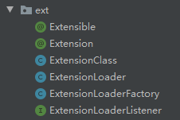

### 拓展点机制
* 拓展点机制是sofa rpc自己实现的一套spi机制，全部代码在`com.alipay.sofa.rpc.ext`包下。   
  

* 相比原生spi，实现了更强大的功能：
    1. 按需加载
    2. 可以有别名
    3. 可以有优先级进行排序和覆盖
    4. 可以控制是否单例
    5. 可以在某些场景下使用编码
    6. 可以指定扩展配置位置
    7. 可以排斥其他扩展点     
* 简单使用：
    1. 创建一个接口或者抽象类，并用`@Extensible`注解标注，声明该类是一个可拓展的
    ```java
    @Extensible
    public interface Person {

        void getName();
    }
    ```
    2. 实现接口，并用`@Extension`注解标注，声明该类是一个拓展点实现类
    ```java
    @Extension("A")
    public class PersonA implements Person {
        @Override
        public void getName() {
            System.out.println("PersonA");
        }
    }

    @Extension("B")
    public class PersonB implements Person {
        @Override
        public void getName() {
            System.out.println("PersonB");
        }
    }
    ```
    3. 编写拓展描述文件，在接口模块下的`META-INF/services/sofa-rpc/接口名`文件中
    ```text
    A=com.alipay.sofa.rpc.ext.test.PersonA
    B=com.alipay.sofa.rpc.ext.test.PersonB
    ```
    4. 加载拓展点，获取到拓展实现类
    ```java
    public class Main {
        public static void main(String[] args) {
            // 获取拓展点加载器，每个可拓展接口对应一个加载器
            ExtensionLoader<Person> extensionLoader = ExtensionLoaderFactory.getExtensionLoader(Person.class);
            // 获取拓展实现类
            Person person = extensionLoader.getExtension("B");
            person.getName();
        }
    }
    ```
* 大致过程就是：
    1. 读取拓展描述文件，获取所有实现了此拓展的实现类名
    2. 加载这些类，将`Class`对象缓存起来
    3. 根据别名找到`Class`对象，进而获取对象实例
---

源码
* 注解
```java
@Documented
@Retention(RetentionPolicy.RUNTIME)
@Target({ ElementType.TYPE })
public @interface Extensible {

    // 指定自定义扩展文件名称，默认就是全类名
    String file() default "";

    // 扩展类是否使用单例，默认使用
    boolean singleton() default true;

    // 扩展类是否需要编码，默认不需要
    boolean coded() default false;
}
```
```java
@Documented
@Retention(RetentionPolicy.RUNTIME)
@Target({ ElementType.TYPE })
public @interface Extension {
    
    // 扩展点名字
    String value();
    
    // 扩展点编码，默认不需要，当接口需要编码的时候需要
    byte code() default -1;

    // 优先级排序，默认不需要
    int order() default 0;

    // 是否覆盖其它低order的同名扩展
    boolean override() default false;

    // 排斥其它扩展，可以排斥掉其它低order的扩展
    String[] rejection() default {};
}
```
* `ExtensionLoaderFactory`，用于获取某个接口或抽象类的拓展点加载器：
```java
public class ExtensionLoaderFactory {
    private ExtensionLoaderFactory() {
    }
    // 缓存
    private static final ConcurrentMap<Class, ExtensionLoader> LOADER_MAP = new ConcurrentHashMap<Class, ExtensionLoader>();

    public static <T> ExtensionLoader<T> getExtensionLoader(Class<T> clazz, ExtensionLoaderListener<T> listener) {
        ExtensionLoader<T> loader = LOADER_MAP.get(clazz);
        if (loader == null) {
            // 如果缓存获取不到，再去创建这个类的拓展点加载器
            synchronized (ExtensionLoaderFactory.class) {
                loader = LOADER_MAP.get(clazz);
                if (loader == null) {
                    loader = new ExtensionLoader<T>(clazz, listener);
                    LOADER_MAP.put(clazz, loader);
                }
            }
        }
        return loader;
    }

    public static <T> ExtensionLoader<T> getExtensionLoader(Class<T> clazz) {
        return getExtensionLoader(clazz, null);
    }
}
```

* `ExtensionLoader`拓展点加载器，用于加载获取拓展实现类：     
域
```java
// 可拓展接口
protected final Class<T> interfaceClass;
// 接口名
protected final String interfaceName;
// 可拓展接口注解
protected final Extensible extensible;
// 部的加载的实现类 {"alias":ExtensionClass}
protected final ConcurrentMap<String, ExtensionClass<T>> all;
// 如果是单例，那么factory不为空
protected final ConcurrentMap<String, T> factory;
// 加载监听器，当实现类被加载时调用
protected final ExtensionLoaderListener<T> listener;
```
构造器，主要是各个字段校验初始化，如果配置自动加载，会去加载实现类
```java
protected ExtensionLoader(Class<T> interfaceClass, boolean autoLoad, ExtensionLoaderListener<T> listener) {
    if (RpcRunningState.isShuttingDown()) {
        this.interfaceClass = null;
        this.interfaceName = null;
        this.listener = null;
        this.factory = null;
        this.extensible = null;
        this.all = null;
        return;
    }
    // 接口为空，既不是接口，也不是抽象类
    if (interfaceClass == null || !(interfaceClass.isInterface() || Modifier.isAbstract(interfaceClass.getModifiers()))) {
        throw new IllegalArgumentException("Extensible class must be interface or abstract class!");
    }
    this.interfaceClass = interfaceClass;
    this.interfaceName = ClassTypeUtils.getTypeStr(interfaceClass);
    this.listener = listener;
    Extensible extensible = interfaceClass.getAnnotation(Extensible.class);
    if (extensible == null) {
        throw new IllegalArgumentException("Error when load extensible interface " + interfaceName + ", must add annotation @Extensible.");
    } else {
        this.extensible = extensible;
    }

    this.factory = extensible.singleton() ? new ConcurrentHashMap<String, T>() : null;
    this.all = new ConcurrentHashMap<String, ExtensionClass<T>>();
    // 自动加载
    if (autoLoad) {
        // 获取放置拓展描述文件的目录
        List<String> paths = RpcConfigs.getListValue(RpcOptions.EXTENSION_LOAD_PATH);
        // 从每个文件中加载实现类
        for (String path : paths) {
            loadFromFile(path);
        }
    }
}
```


先从配置文件中获取放置拓展文件的目录，默认是`META-INF/services/sofa-rpc/`和`META-INF/services/`，然后从每个路径中查找描述文件，加载实现类： 
```java
protected synchronized void loadFromFile(String path) {
    // 文件名在@Extension注解中配置
    // 默认如果不指定文件名字，就是接口名
    String file = StringUtils.isBlank(extensible.file()) ? interfaceName : extensible.file().trim();
    String fullFileName = path + file;
    try {
        ClassLoader classLoader = ClassLoaderUtils.getClassLoader(getClass());
        loadFromClassLoader(classLoader, fullFileName);
    } catch (Throwable t) {

    }
}
```
```java
protected void loadFromClassLoader(ClassLoader classLoader, String fullFileName) throws Throwable {
    Enumeration<URL> urls = classLoader != null ? classLoader.getResources(fullFileName)
        : ClassLoader.getSystemResources(fullFileName);
    // 可能存在多个文件。
    if (urls != null) {
        while (urls.hasMoreElements()) {
            // 读取一个文件
            URL url = urls.nextElement();
            BufferedReader reader = null;
            try {
                reader = new BufferedReader(new InputStreamReader(url.openStream(), "UTF-8"));
                String line;
                while ((line = reader.readLine()) != null) {
                    readLine(url, line);
                }
            } catch (Throwable t) {

            } finally {
                if (reader != null) {
                    reader.close();
                }
            }
        }
    }
}
```

获取类名并加载类
```java
protected void readLine(URL url, String line) {
    String[] aliasAndClassName = parseAliasAndClassName(line);
    if (aliasAndClassName == null || aliasAndClassName.length != 2) {
        return;
    }
    String alias = aliasAndClassName[0];
    String className = aliasAndClassName[1];
    // 读取配置的实现类
    Class tmp;
    try {
        // 加载拓展实现类
        tmp = ClassUtils.forName(className, false);
    } catch (Throwable e) {

        return;
    }
    if (!interfaceClass.isAssignableFrom(tmp)) {
        throw new IllegalArgumentException("Error when load extension of extensible " + interfaceName +
            " from file:" + url + ", " + className + " is not subtype of interface.");
    }
    Class<? extends T> implClass = (Class<? extends T>) tmp;

    // 检查是否有可扩展标识
    Extension extension = implClass.getAnnotation(Extension.class);

    ... 一堆校验操作 ...
    // 检查是否有存在同名的
    ExtensionClass old = all.get(alias);
    ExtensionClass<T> extensionClass = null;
    if (old != null) {
        // 如果当前扩展可以覆盖其它同名扩展
        if (extension.override()) {
            // 如果优先级还没有旧的高，则忽略
            if (extension.order() < old.getOrder()) {

            } else {
                // 如果当前扩展可以覆盖其它同名扩展
                extensionClass = buildClass(extension, implClass, alias);
            }
        }
        // 如果旧扩展是可覆盖的
        else {
            if (old.isOverride() && old.getOrder() >= extension.order()) {

            } else {
                // 如果不能被覆盖，抛出已存在异常
                throw new IllegalStateException("Error when load extension of extensible " + interfaceClass + " from file:" + url + ", Duplicate class with same alias: " + alias + ", " + old.getClazz() + " and " + implClass);
            }
        }
    } else {
        // 包装成ExtensionClass
        extensionClass = buildClass(extension, implClass, alias);
    }
    if (extensionClass != null) {
        // 检查是否有互斥的扩展点
        for (Map.Entry<String, ExtensionClass<T>> entry : all.entrySet()) {
            ExtensionClass existed = entry.getValue();
            if (extensionClass.getOrder() >= existed.getOrder()) {
                // 新的优先级 >= 老的优先级，检查新的扩展是否排除老的扩展
                String[] rejection = extensionClass.getRejection();
                if (CommonUtils.isNotEmpty(rejection)) {
                    for (String rej : rejection) {
                        existed = all.get(rej);
                        if (existed == null || extensionClass.getOrder() < existed.getOrder()) {
                            continue;
                        }
                        ExtensionClass removed = all.remove(rej);
                        if (removed != null) {

                        }
                    }
                }
            } else {
                String[] rejection = existed.getRejection();
                if (CommonUtils.isNotEmpty(rejection)) {
                    for (String rej : rejection) {
                        if (rej.equals(extensionClass.getAlias())) {
                            //// 被其它扩展排掉
                        }
                    }
                }
            }
        }
        loadSuccess(alias, extensionClass);
    }
}
```


最后，加载完成后，调用`loadSuccess`方法，调用监听器：
```java
private void loadSuccess(String alias, ExtensionClass<T> extensionClass) {
    if (listener != null) {
        try {
            listener.onLoad(extensionClass); // 加载完毕，通知监听器
            all.put(alias, extensionClass);
        } catch (Exception e) {
        }
    } else {
        all.put(alias, extensionClass);
    }
}
```

之后，就可以根据别名从加载器中获取拓展实现类
```java
public T getExtension(String alias) {
    ExtensionClass<T> extensionClass = getExtensionClass(alias);
    if (extensionClass == null) {
        throw new SofaRpcRuntimeException("Not found extension of " + interfaceName + " named: \"" + alias + "\"!");
    } else {
        // 如果是单例，这个单例对象是缓存在名为factory这个map中
        if (extensible.singleton() && factory != null) {
            T t = factory.get(alias);
            if (t == null) {
                synchronized (this) {
                    t = factory.get(alias);
                    if (t == null) {
                        t = extensionClass.getExtInstance();
                        factory.put(alias, t);
                    }
                }
            }
            return t;
        } else {
            return extensionClass.getExtInstance();
        }
    }
}
```